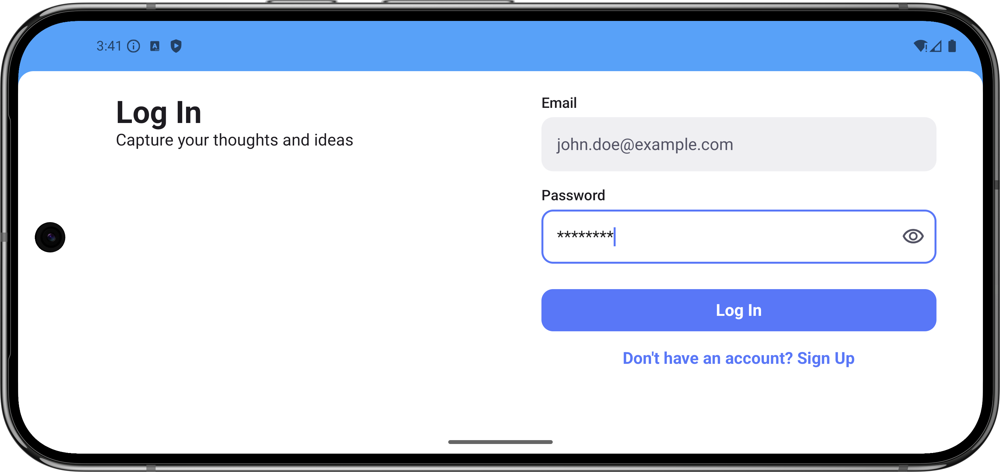
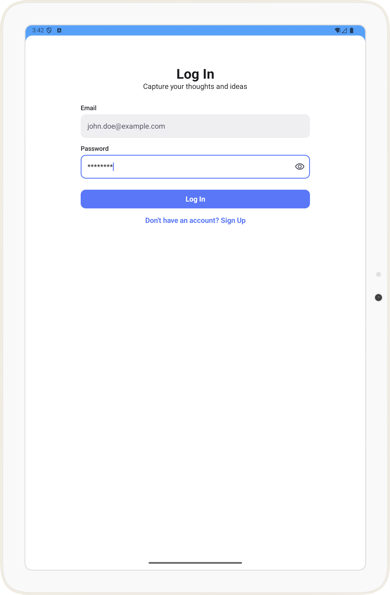

# One-Off Events Demo with StateFlow & Clean Architecture & Responsive Compose UI

This Android project demonstrates a robust approach to handling one-off events (like showing Snackbars, navigating, or triggering dialogs) in a Jetpack Compose UI, utilizing `StateFlow` as an alternative to `Channels` or `SharedFlow`. It is built following Clean Architecture principles and showcases adaptive UI design for various screen sizes and orientations.

## Core Concepts & Goals

*   **Reliable One-Off Event Handling:** The primary goal is to showcase a mechanism for emitting events from ViewModels (or similar presentation layer components) to the UI such that each event is consumed exactly once, even across configuration changes. This project uses a `StateFlow`-based wrapper (e.g., `AutoConsumableEffectDelegate` or similar) to achieve this.
*   **Clean Architecture:** The project structure adheres to Clean Architecture principles, separating concerns into distinct layers:
    *   **Domain:** Contains core business logic, use cases, and entities. Independent of other layers.
    *   **Data:** Implements repository interfaces defined in the domain layer, handling data sources (network, local database, etc.).
    *   **Presentation (UI):** Consists of Jetpack Compose UI elements, ViewModels (following MVI or a similar pattern), and handles user interaction and state display.
*   **Jetpack Compose & Adaptive Design:** The UI is built entirely with Jetpack Compose. It demonstrates how to create adaptive layouts that respond to different window sizes, orientations, and device types (phone, tablet, landscape, portrait). This involves using `WindowSizeClass`.
*   **State Management with StateFlow:** UI state and one-off events are managed using Kotlin `StateFlow`, promoting a reactive and consistent approach to state updates.
*   **Dependency Injection:** Utilizes Koin for managing dependencies throughout the application.

## Why StateFlow for One-Off Events?

While `Channels` and `SharedFlow` are often used for one-off events, this project explores an alternative using `StateFlow` wrapped in a custom delegate. The rationale includes:

*   **Simpler Observation in Compose:** `StateFlow` integrates seamlessly with Compose's `collectAsStateWithLifecycle()` (or `collectAsState()`), which is often already used for observing UI state.
*   **State Restoration:** The chosen mechanism aims to be robust against configuration changes, ensuring events are not lost or re-triggered unintentionally.
*   **Explicit Consumption:** The delegate pattern typically involves an explicit "consume" action after the UI has processed the event, resetting the `StateFlow`'s value to prevent re-consumption.

## Key Components & Libraries

*   [Kotlin](https://kotlinlang.org/) & [Coroutines](https://kotlinlang.org/docs/coroutines-overview.html)
*   [Jetpack Compose](https://developer.android.com/jetpack/compose) for UI
    *   Compose Material 3
    *   Compose Navigation
    *   Compose Window Size Classes for adaptive layouts
*   [ViewModel](https://developer.android.com/topic/libraries/architecture/viewmodel) (Jetpack Lifecycle)
*   [StateFlow](https://kotlinlang.org/api/kotlinx.coroutines/kotlinx-coroutines-core/kotlinx.coroutines.flow/-state-flow/) for state management and event handling
*   [Koin](https://insert-koin.io/) for Dependency Injection (or Hilt - specify)

## How to Build & Run

1.  Clone the repository.
2.  Open the project in Android Studio (latest stable version recommended).
3.  Let Gradle sync and download dependencies.
4.  Run the app on an emulator or a physical device.

## Focus Areas for Exploration

*   **`AutoConsumableEffectDelegate.kt`:** Examine this class in `core/presentation/util` to understand the `StateFlow`-based event handling.
*   **ViewModel Implementations:** See how ViewModels (e.g., `LoginViewModel.kt`, `UserProfileViewModel.kt`) post effects using the delegate.
*   **Composable Screen Event Collection:** Observe how Composable functions collect and handle these one-off events, typically within a `LaunchedEffect` that depends on the event state.
*   **Adaptive Layouts:** Check Composable functions that use `WindowSizeClass` to adjust their layout (e.g., `LoginScreen.kt` might have different arrangements for portrait/landscape/tablet).
*   **DI Modules:** Review the Koin modules in the `di` package to see how dependencies are provided.

## Contribution

Feel free to fork this project, open issues, and submit pull requests. Contributions that enhance the demonstration of the core concepts are welcome.